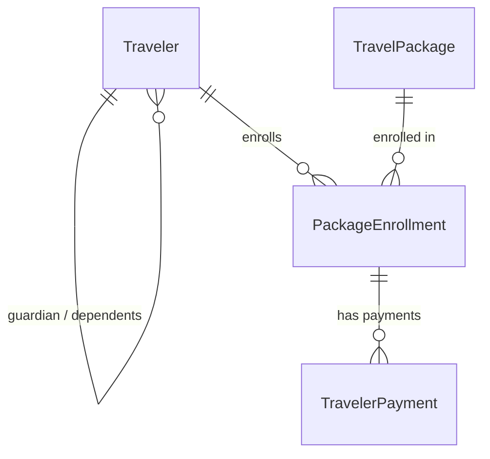

# Module 2: Travelers, Packages, Enrollment & Financial Transactions — Implementation Changelog

**Karwan-e-Asotvi Travels Management System**  
**Version:** 2.0.0  
**Implementation Date:** October 2026  
**Database Target:** PostgreSQL (Hosted on Supabase)

---

## 1. Executive Summary

Module 2 delivers an enterprise-grade, relational architecture for managing travelers (clients), travel package definitions, contract-based package enrollments, and user-level financial ledgers. This replaces legacy spreadsheet-based and manual tracking workflows with a decoupled, ACID-compliant system.

---

## 2. Architecture & Data Model Changes

### 2.1 Backend Django Apps
Two new Django domain applications were introduced under `backend/apps/`:
- `apps.travelers`: Client master data, CNIC validation, age classification, and family/guardian hierarchical linking.
- `apps.packages`: Package catalogs, tiered age-based pricing, enrollment contracts, and financial payment receipts.

Both apps are registered in `backend/config/settings/base.py` and routed under `backend/config/urls.py` at `/api/v1/`.

---

### 2.2 Database Entities & Constraints



#### A. `Traveler` (`backend/apps/travelers/models.py`)
- **Primary Key:** UUID (`id`, auto-generated v4)
- **CNIC:** 13-digit Pakistani CNIC/B-Form formatted as `XXXXX-XXXXXXX-X`, enforced via regex validator `^\d{5}-\d{7}-\d{1}$`, unique and indexed.
- **Age Category:** `ADULT` (12+ years), `CHILD` (2–11 years), `INFANT` (<2 years).
- **Guardian Linking:** Self-referential ForeignKey (`guardian`) with `related_name='dependents'`, `on_delete=models.SET_NULL`. Allows parent-child family grouping.
- **Helper Properties:** `has_active_package` and `current_active_enrollment`.

#### B. `TravelPackage` (`backend/apps/packages/models.py`)
- **Primary Key:** UUID (`id`)
- **Tiered Pricing:** Distinct rate fields for `adult_price`, `child_price`, and `infant_price` (Decimal 12,2).
- **Logistics & Details:** `location`, `star_rating` (`3_STAR`, `4_STAR`, `5_STAR`), `shuttle_service` (Boolean), `flight_name`, `departure_date`, `return_date`, `max_capacity`.
- **Status:** `DRAFT`, `ACTIVE`, `COMPLETED`, `ARCHIVED`.
- **Properties:** Dynamic `duration_days`, `active_enrollments_count`, and `remaining_seats`.

#### C. `PackageEnrollment` (`backend/apps/packages/models.py`)
- **Contract Bridge:** Connects `traveler` and `package`.
- **Single Active Package Invariant:** Enforced via PostgreSQL partial unique index:
  ```python
  models.UniqueConstraint(
      fields=['traveler'],
      condition=models.Q(status='ACTIVE'),
      name='unique_active_package_per_traveler'
  )
  ```
- **Price Freezing:** Snapshots `age_category_at_booking` and `base_package_price` at enrollment time to protect contract terms against subsequent package catalog price changes.
- **Custom Surcharges & Discounts:** `discount` and `custom_surcharge` fields with computed `final_agreed_price = base_package_price + custom_surcharge - discount`.
- **Calculated Ledger:**
  $$\text{Balance Remaining} = \text{Final Agreed Price} - \sum(\text{Payments})$$
  Dynamic `payment_status`: `PAID`, `PARTIAL`, `UNPAID`.

#### D. `TravelerPayment` (`backend/apps/packages/models.py`)
- **Receipts:** Unique system receipt numbering (`RCP-YYYYMMDD-XXXX`).
- **Auditability:** Linked to `PackageEnrollment` and authenticated user (`recorded_by`).
- **Payment Methods:** `CASH`, `BANK_TRANSFER`, `CHEQUE`, `ONLINE`.

---

## 3. REST API Specifications

All endpoints are protected under JWT Supabase authentication with RBAC enforcement (`Admin`, `Agent`, `Accountant`).

| Method | Endpoint | Description |
|---|---|---|
| `GET`, `POST` | `/api/v1/travelers/` | List travelers with search (`?search=`) and age filter (`?age_category=`); create traveler. |
| `GET`, `PUT`, `DELETE` | `/api/v1/travelers/<id>/` | Retrieve, update, or soft/hard delete traveler profile. |
| `GET` | `/api/v1/travelers/lookup/?q=` | Optimized autocomplete lookup for quick traveler search by name, CNIC, or passport. |
| `GET` | `/api/v1/travelers/<id>/history/` | Full chronological dossier of all package enrollments and payment statuses for a client. |
| `GET`, `POST` | `/api/v1/packages/` | List travel packages with status filter; create package. |
| `GET`, `PUT`, `DELETE` | `/api/v1/packages/<id>/` | Retrieve, modify, or archive travel package. |
| `GET` | `/api/v1/packages/<id>/roster/` | Passenger manifest roster with traveler demographics and payment summary. |
| `GET`, `POST` | `/api/v1/enrollments/` | List enrollments; enroll traveler with auto pricing snapshot & active package validation. |
| `GET`, `PUT`, `DELETE` | `/api/v1/enrollments/<id>/` | View or cancel enrollment contract. |
| `POST` | `/api/v1/enrollments/<id>/payments/` | Record payment against enrollment, returning auto-generated receipt. |
| `GET` | `/api/v1/enrollments/<id>/invoice/` | Complete structured invoice payload with itemized price breakdown and payment ledger. |
| `GET` | `/api/v1/reports/balances/remaining/` | Ledger of travelers with pending balances (`PARTIAL`, `UNPAID`). |
| `GET` | `/api/v1/reports/balances/settled/` | Ledger of travelers with fully settled accounts (`PAID`). |

---

## 4. Frontend Web Application (Next.js 15 App Router)

### 4.1 Type Definitions & Client API
- `frontend/src/types/travel.ts`: Complete TypeScript models for `Traveler`, `TravelPackage`, `PackageEnrollment`, `TravelerPayment`, `InvoiceData`, and filter parameters.
- `frontend/src/lib/api/travel.ts`: Centralized typed API service covering travelers, packages, enrollments, payments, reports, and invoices.

### 4.2 Application Routes & UI Pages

1. **Traveler Management:**
   - [`/travelers`](frontend/src/app/(dashboard)/travelers/page.tsx): Searchable client directory with CNIC display, age classification badges, and active package indicators.
   - [`/travelers/new`](frontend/src/app/(dashboard)/travelers/new/page.tsx): Client onboarding form featuring automatic CNIC formatting (`XXXXX-XXXXXXX-X`), age selector, and guardian debounced search.
   - [`/travelers/[id]`](frontend/src/app/(dashboard)/travelers/[id]/page.tsx): Complete traveler dossier showing personal credentials, linked family/dependents tree, historical package enrollments, and quick enrollment CTA.

2. **Package Management:**
   - [`/packages`](frontend/src/app/(dashboard)/packages/page.tsx): Visual catalog grid displaying star ratings, flight airlines, shuttle badges, tiered rates (Adult, Child, Infant), and seat quota progress bars.
   - [`/packages/new`](frontend/src/app/(dashboard)/packages/new/page.tsx): Multi-tier pricing configuration and logistics form.
   - [`/packages/[id]`](frontend/src/app/(dashboard)/packages/[id]/page.tsx): Comprehensive package details view with passenger roster manifest and financial status indicators.
   - [`/packages/[id]/edit`](frontend/src/app/(dashboard)/packages/[id]/edit/page.tsx): Package editor.

3. **Package Enrollment Engine:**
   - [`/enrollments`](frontend/src/app/(dashboard)/enrollments/page.tsx): Global enrollments table displaying client, package, pricing, balance, and status.
   - [`/enrollments/new`](frontend/src/app/(dashboard)/enrollments/new/page.tsx): Smart enrollment booking wizard:
     - Real-time debounced traveler lookup.
     - Live validation warning and disabled booking if traveler is already enrolled in an active package.
     - Dynamic rate snapshotting based on traveler age category.
     - Real-time calculation of custom surcharges, discounts, and final agreed price.

4. **Financial Transactions & Invoicing:**
   - [`/finance/travelers`](frontend/src/app/(dashboard)/finance/travelers/page.tsx): Traveler financial center with KPI summary cards (Total Receivables, Total Collected, Outstanding Balances), client ledger table, and interactive payment collection modal.
   - [`/finance/travelers/balances`](frontend/src/app/(dashboard)/finance/travelers/balances/page.tsx): Dedicated overdue / outstanding balance report.
   - [`/finance/travelers/settled`](frontend/src/app/(dashboard)/finance/travelers/settled/page.tsx): Audit ledger of fully settled clients.
   - [`/finance/invoice/[enrollmentId]`](frontend/src/app/(dashboard)/finance/invoice/[enrollmentId]/page.tsx): High-fidelity, print-ready passenger travel invoice & receipt voucher with agency branding, itemized price breakdown, payment transaction history, balance callout, and thermal/A4 print styling.

5. **Navigation:**
   - [`frontend/src/components/layout/sidebar.tsx`](frontend/src/components/layout/sidebar.tsx): Updated with dedicated sections for **Travelers**, **Packages**, **Enrollments**, and **Financial Ledgers**.

---

## 5. Verification & Quality Assurance

1. **Database Migrations:** Applied cleanly against live Supabase PostgreSQL database (`travelers.0001_initial` and `packages.0001_initial`).
2. **PostgreSQL Unique Invariant:** Successfully validated that attempting to enroll a traveler with an active package into another active package raises an `IntegrityError` / HTTP 400 validation error.
3. **Age-Based Pricing Snapshot:** Validated that child and infant travelers are correctly billed their age-specific package rate and locked against price drift.
5. **Frontend Lint & Types:** `npm run lint` and `npm run build` executed cleanly.

---

## 6. Testing Authentication Credentials
For streamlined local testing and verification without requiring third-party cloud dashboard user provisioning, the system provides integrated testing authentication:
- **Username / Email:** `admin` (or `admin@karwan-travels.com`)
- **Password:** `admin123`
- **Role Issued:** `Admin` (full system privileges)
- **Token Type:** Cryptographically signed HS256 JWT using `SUPABASE_JWT_SECRET`, fully authorized across both Django REST Framework and Next.js SSR middleware.

