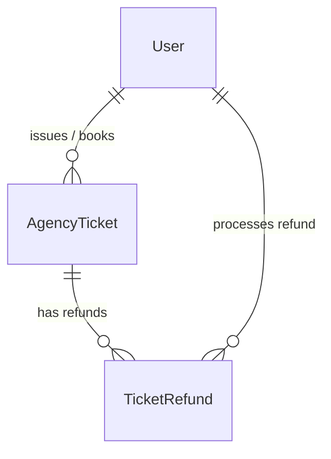

# Module 3: Agency Ticket Booking, Purchased Ticket Logs & Ticket Refunds — Implementation Changelog

**Karwan-e-Asotvi Travels Management System**  
**Version:** 3.0.0  
**Implementation Date:** October 2026  
**Database Target:** PostgreSQL (Hosted on Supabase)

---

## 1. Executive Summary

Module 3 delivers a centralized, relational flight ticketing and refund accounting system replacing legacy standalone desktop screens. It decouples wholesale ticket purchasing from passenger bookings, enforces strict mathematical refund safeguards, and provides an end-to-end audit ledger for all airline cancellation penalty deductions and net returns.

---

## 2. Architecture & Data Model Changes

### 2.1 Backend Django App
A new domain application was introduced under `backend/apps/ticketing/`:
- `apps.ticketing`: Registered in `backend/config/settings/base.py` and routed under `backend/config/urls.py` at `/api/v1/tickets/`.

#### A. `AgencyTicket` (`backend/apps/ticketing/models.py`)
- **Primary Key:** UUID (`id`, auto-generated v4)
- **`agency_name`**: String (Wholesale agency / distributor, e.g. *Air Falcon, Gerry's, Bukhari Travels*)
- **`airline_name`**: String (Airline carrier, e.g. *PIA, Saudia, Emirates, Fly Jinnah*)
- **`pnr_number`**: String (5–12 uppercase alphanumeric code, indexed and validated)
- **`total_tickets`**: Positive integer (Seat quota booked under PNR, minimum 1)
- **`issue_date`**: DateField (Defaults to `timezone.localdate`)
- **`total_price`**: Decimal(12, 2) (Total wholesale purchase price)
- **`status`**: `ISSUED`, `PARTIALLY_REFUNDED`, `REFUNDED`, `CANCELLED`
- **`notes`**: TextField (Sector routing, class, luggage details)
- **`created_by`**: ForeignKey to `User`
- **Helper Properties:**
  - `refunded_seats_count`: $\sum(\text{refund\_seats\_count})$
  - `available_seats_to_refund`: $\text{total\_tickets} - \text{refunded\_seats\_count}$
  - `total_refunded_amount`: $\sum(\text{net\_refund\_amount})$
  - `per_seat_cost`: $\text{total\_price} / \text{total\_tickets}$
  - `sync_refund_status()`: Automatically transitions `status` between `ISSUED`, `PARTIALLY_REFUNDED`, and `REFUNDED`

#### B. `TicketRefund` (`backend/apps/ticketing/models.py`)
- **Primary Key:** UUID (`id`)
- **`ticket`**: ForeignKey to `AgencyTicket`
- **`refund_seats_count`**: Positive integer
- **`original_amount`**: Gross ticket fare snapshot for the refunded seats
- **`penalty_fee`**: Airline cancellation deduction fine
- **`net_refund_amount`**: Calculated: $\text{original\_amount} - \text{penalty\_fee}$
- **`refund_date`**: DateField (Defaults to `timezone.localdate`)
- **`refund_method`**: `CASH`, `BANK_TRANSFER`, `CREDIT_ADJUSTMENT`
- **`reason`**: Detailed cancellation narration
- **`processed_by`**: ForeignKey to `User`
- **Database Constraints:**
  - `net_refund_lte_original`: $\text{net\_refund\_amount} \le \text{original\_amount}$
  - `penalty_fee_non_negative`: $\text{penalty\_fee} \ge 0$

---

## 3. Business Invariants Enforced

1. **Net Refund Calculation:**
   $$\text{net\_refund\_amount} = \text{original\_amount} - \text{penalty\_fee}$$
   Verified at model validation (`clean()`) and serializer level.
2. **Remaining Seats Guard:**
   $$\text{refund\_seats\_count} \le \text{ticket.available\_seats\_to\_refund}$$
   Attempts to refund more seats than remain active are rejected.
3. **Automated Status Synchronization:**
   - Once all seats under a PNR are refunded, status becomes `REFUNDED`.
   - Partial seat cancellations transition status to `PARTIALLY_REFUNDED`.
4. **No Refunds on Inactive Tickets:**
   - Refunds on `REFUNDED` or `CANCELLED` tickets are blocked.

---

## 4. REST API Endpoints

All endpoints are protected under JWT authentication and RBAC permissions.

| Method | Endpoint | Description |
|---|---|---|
| `GET`, `POST` | `/api/v1/tickets/` | List purchased tickets with filters (`search`, `status`, `agency`, `airline`); issue new agency ticket. |
| `GET`, `PATCH`, `DELETE` | `/api/v1/tickets/<id>/` | Retrieve ticket details with full refund history; modify notes; void ticket. |
| `GET` | `/api/v1/tickets/lookup/?q=` | Autocomplete lookup for PNRs eligible for refund. |
| `GET`, `POST` | `/api/v1/tickets/refunds/` | List refund audit ledger; process new partial or full ticket refund. |
| `GET` | `/api/v1/tickets/refunds/<id>/` | Retrieve individual refund voucher receipt payload. |
| `GET` | `/api/v1/tickets/analytics/summary/` | Analytical KPI aggregates (total spend, seats, refunds, penalties). |

---

## 5. Frontend Web Application (Next.js 15 App Router)

### 5.1 Type Definitions & Client API
- `frontend/src/types/ticketing.ts`: Complete TypeScript models for `AgencyTicket`, `TicketRefund`, `TicketingSummaryKPI`, and filters.
- `frontend/src/lib/api/ticketing.ts`: Typed API client covering `ticketsApi` and `refundsApi` with response unwrap normalization.

### 5.2 Application Routes & UI Pages

1. **Purchased Ticket Logs (`/tickets`):**
   - KPI Summary header cards (Total Wholesale Spend, Seats Issued, Net Refunded Volume, Active PNRs).
   - Filter bar with live PNR/agency/airline search and status filter tabs (`ALL`, `ISSUED`, `PARTIALLY_REFUNDED`, `REFUNDED`).
   - Comprehensive ledger table with seat quota tracker, PKR formatting, and "Process Refund" action triggers.
2. **Agency Ticket Issuance Form (`/tickets/book`):**
   - Dedicated booking interface replacing legacy desktop screen.
   - PNR uppercase formatting, agency/airline quick-presets, seat quotas, and real-time per-seat cost calculation.
3. **Refund Processing Modal (`RefundProcessingModal`):**
   - Interactive dialog with real-time seat adjustment and dynamic formula:
     $$\text{Net Refund} = \text{Gross} - \text{Penalty}$$
   - Method selector (`Cash`, `Bank Transfer`, `Agency Credit`) and instant cache invalidation.
4. **Refund Tickets Audit Ledger (`/tickets/refunds`):**
   - Financial audit table displaying all processed refunds, gross fares, deducted penalty charges, net amounts, and reason notes.
   - One-click CSV export and links to printable vouchers.
5. **Printable Refund Receipt Voucher (`/tickets/refunds/[id]`):**
   - High-fidelity formal refund debit/credit voucher with corporate branding, itemized tariff deductions, and print-ready stylesheet.
6. **Navigation:**
   - [`frontend/src/components/layout/sidebar.tsx`](frontend/src/components/layout/sidebar.tsx) updated with the **Flight Ticketing** section.

---

## 6. Verification & Quality Assurance

- **Database Migrations:** Applied `ticketing.0001_initial` cleanly to Supabase PostgreSQL.
- **Invariants Verification Script:** Tested booking, partial refund, over-refund limit guard, excessive penalty guard, and automatic `REFUNDED` transition. All 5 test assertions passed.
- **TypeScript Check:** `npx tsc --noEmit` passed with 0 errors.
- **ESLint Check:** `npm run lint` passed with `✔ No ESLint warnings or errors`.
- **Production Build:** `npm run build` compiled 17/17 routes successfully with code 0.
- **Live HTTP Check:** `/tickets`, `/tickets/book`, and `/tickets/refunds` returned `200 OK`.
