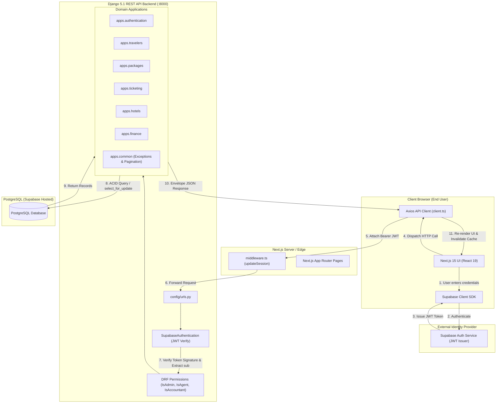
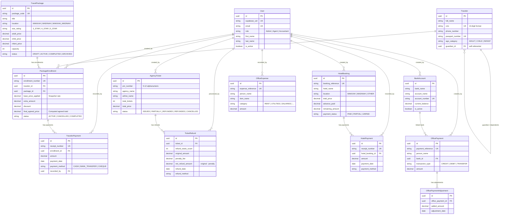
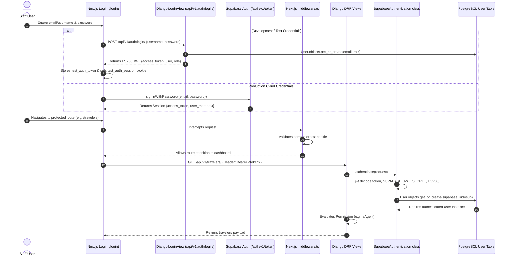
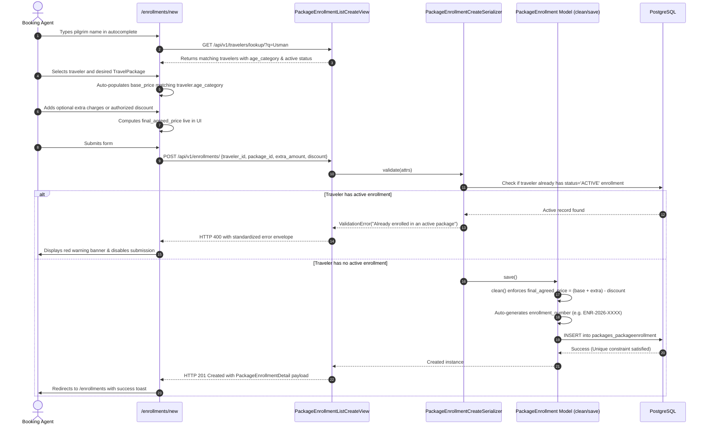
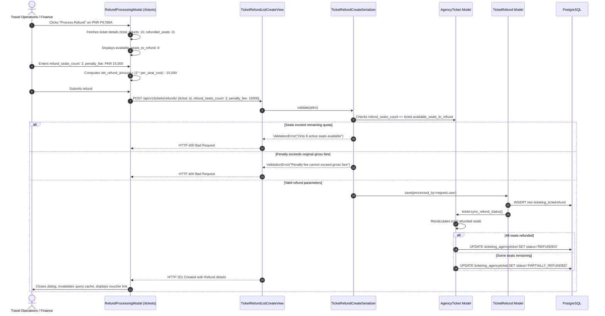
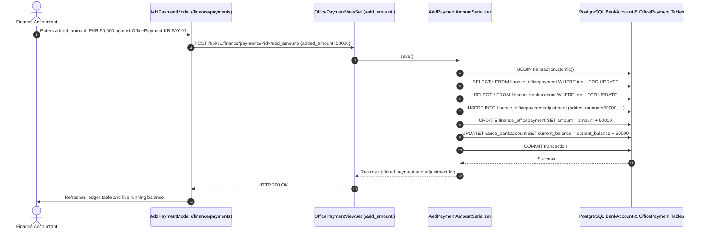

# System Architecture & Technical Onboarding Guide
**Karwan-e-Asotvi Travels — Enterprise Management System**  
**Document Version:** 1.0.0  
**Target Audience:** Junior Software Engineers & Onboarding Developers  
**Author:** Senior Software Architect  
**Repository:** `Karwan-e-Asotvi Travels`

---

## Welcome to the Team! 👋

Welcome to Karwan-e-Asotvi Travels. As an incoming engineer, you are joining an enterprise modernization project. This platform replaces legacy desktop software and fragmented manual spreadsheets with a high-performance, cloud-native web application designed for Hajj, Umrah, and international travel management.

This document is your comprehensive architectural companion. It lays out how the codebase is organized, how data flows across the stack, the invariant business rules you must protect, and where to go when you need to write code.

---

## 1. Tech Stack Overview

The application is structured as a decoupled **monorepo** containing a Python/Django REST backend and a TypeScript/Next.js frontend.

```
┌────────────────────────────────────────────────────────────────────────┐
│                        NEXT.JS 15 FRONTEND                             │
│  React 19 • App Router • TypeScript • Tailwind CSS • TanStack Query    │
└──────────────────────────────────┬─────────────────────────────────────┘
                                   │ HTTP / JSON (Bearer JWT)
                                   ▼
┌────────────────────────────────────────────────────────────────────────┐
│                        DJANGO 5.1 REST API                             │
│  Django REST Framework • PyJWT • Psycopg 3 • Custom RBAC System        │
└──────────────────────────────────┬─────────────────────────────────────┘
                                   │ SQL (ACID Transactions & Row Locks)
                                   ▼
┌────────────────────────────────────────────────────────────────────────┐
│                   SUPABASE POSTGRESQL DATABASE                         │
│  Relational Integrity • Constraints • Partial Indexes • Audit Schemas  │
└────────────────────────────────────────────────────────────────────────┘
```

### Full Technology Matrix

| Layer | Technology | Version | Purpose in Codebase |
|---|---|---|---|
| **Frontend Framework** | [Next.js](file:///e:/KARWAN%20E%20ASOTVI%20TRAVELS/frontend/package.json#L20) | `15.1.7` | Server and Client Components via the Next.js App Router. |
| **Frontend UI Library** | [React](file:///e:/KARWAN%20E%20ASOTVI%20TRAVELS/frontend/package.json#L21) | `19.0.0` | Core UI component lifecycle and declarative rendering. |
| **Language (Frontend)** | [TypeScript](file:///e:/KARWAN%20E%20ASOTVI%20TRAVELS/frontend/package.json#L36) | `5.7.3` | Strict static typing for models, API contracts, and components. |
| **Styling & Design System** | [Tailwind CSS](file:///e:/KARWAN%20E%20ASOTVI%20TRAVELS/frontend/package.json#L35) | `3.4.17` | Utility-first styling with HSL design tokens in [globals.css](file:///e:/KARWAN%20E%20ASOTVI%20TRAVELS/frontend/src/app/globals.css) and brand palette in [tailwind.config.ts](file:///e:/KARWAN%20E%20ASOTVI%20TRAVELS/frontend/tailwind.config.ts). |
| **Icons & Primitives** | [Lucide React](file:///e:/KARWAN%20E%20ASOTVI%20TRAVELS/frontend/package.json#L19), `clsx`, `tailwind-merge` | `0.475.0` | Scalable travel icons and class name composition ([utils.ts](file:///e:/KARWAN%20E%20ASOTVI%20TRAVELS/frontend/src/lib/utils.ts)). |
| **Client State / Caching** | [TanStack React Query](file:///e:/KARWAN%20E%20ASOTVI%20TRAVELS/frontend/package.json#L15) | `5.66.0` | Asynchronous server-state management, cache invalidation, and optimistic updates. |
| **Forms & Validation** | [React Hook Form](file:///e:/KARWAN%20E%20ASOTVI%20TRAVELS/frontend/package.json#L23) + [Zod](file:///e:/KARWAN%20E%20ASOTVI%20TRAVELS/frontend/package.json#L25) | `7.54.2` / `3.24.2` | Controlled form inputs with schema validation via `@hookform/resolvers/zod`. |
| **HTTP Client** | [Axios](file:///e:/KARWAN%20E%20ASOTVI%20TRAVELS/frontend/package.json#L16) | `1.7.9` | Interceptor-driven REST client injecting JWT headers ([client.ts](file:///e:/KARWAN%20E%20ASOTVI%20TRAVELS/frontend/src/lib/api/client.ts)). |
| **Frontend Auth Client** | [@supabase/ssr](file:///e:/KARWAN%20E%20ASOTVI%20TRAVELS/frontend/package.json#L13) | `0.5.2` | Cookie-based session sync across Next.js edge middleware and server components. |
| **Backend Framework** | [Django](file:///e:/KARWAN%20E%20ASOTVI%20TRAVELS/backend/requirements/base.txt#L1) | `5.1.x` | High-level Python web framework providing ORM, migrations, and Admin portal. |
| **REST API Engine** | [Django REST Framework](file:///e:/KARWAN%20E%20ASOTVI%20TRAVELS/backend/requirements/base.txt#L2) | `3.15.2` | Serializers, Class-Based Views, ViewSets, and custom exception handlers. |
| **Language (Backend)** | Python | `3.12+` (or `3.13`) | Object-oriented backend language with typing hints and clean domain models. |
| **Database Engine** | [PostgreSQL (Supabase)](file:///e:/KARWAN%20E%20ASOTVI%20TRAVELS/backend/config/settings/base.py#L83-L98) | `15+` | Hosted relational database with partial indexes, foreign keys, and check constraints (SQLite local dev fallback). |
| **Database Driver** | [psycopg](file:///e:/KARWAN%20E%20ASOTVI%20TRAVELS/backend/requirements/base.txt#L7) & [dj-database-url](file:///e:/KARWAN%20E%20ASOTVI%20TRAVELS/backend/requirements/base.txt#L6) | `3.2.0` / `2.3.0` | Fast PostgreSQL 3 driver with `DATABASE_URL` environment connection parsing. |
| **JWT Verification** | [PyJWT](file:///e:/KARWAN%20E%20ASOTVI%20TRAVELS/backend/requirements/base.txt#L4) & `cryptography` | `2.10.0` / `44.0.0` | Cryptographic signature verification of Supabase HS256 tokens ([authentication.py](file:///e:/KARWAN%20E%20ASOTVI%20TRAVELS/backend/apps/authentication/authentication.py)). |
| **CORS Middleware** | [django-cors-headers](file:///e:/KARWAN%20E%20ASOTVI%20TRAVELS/backend/requirements/base.txt#L3) | `4.6.0` | Cross-Origin Resource Sharing allowing Next.js requests from `localhost:3000`. |
| **Testing Tools** | [pytest](file:///e:/KARWAN%20E%20ASOTVI%20TRAVELS/backend/requirements/local.txt#L3), [pytest-django](file:///e:/KARWAN%20E%20ASOTVI%20TRAVELS/backend/requirements/local.txt#L4), DRF `APIClient` | `8.3.0` / `4.9.0` | Automated unit/integration test suites ([tests.py](file:///e:/KARWAN%20E%20ASOTVI%20TRAVELS/backend/apps/ticketing/tests.py)). |
| **Containerization** | Docker | Multi-stage | Alpine/slim production image configured in [Dockerfile](file:///e:/KARWAN%20E%20ASOTVI%20TRAVELS/backend/Dockerfile). |

---

## 2. Project Structure & Architectural Style

### Monorepo Structure

```text
KARWAN E ASOTVI TRAVELS/
├── backend/                                # Django 5.1 REST API application root
│   ├── manage.py                           # Django CLI management script
│   ├── Dockerfile                          # Multi-stage production container configuration
│   ├── requirements/                       # Split Python dependency manifests
│   │   ├── base.txt                        # Django, DRF, psycopg, PyJWT, cors-headers
│   │   ├── local.txt                       # Development tools (pytest, black, flake8)
│   │   └── production.txt                  # Production runtime (gunicorn, whitenoise)
│   ├── config/                             # Central project configuration
│   │   ├── asgi.py                         # ASGI asynchronous server entrypoint
│   │   ├── wsgi.py                         # WSGI synchronous web server entrypoint
│   │   ├── urls.py                         # Global URL router & /api/v1/health/ endpoint
│   │   └── settings/                       # Environment-segmented Django settings
│   │       ├── __init__.py
│   │       ├── base.py                     # Installed apps, DB, DRF settings, JWT config
│   │       ├── local.py                    # Local debug settings
│   │       └── production.py               # Hardened security headers, SSL, static handling
│   └── apps/                               # Domain-Driven Django applications
│       ├── common/                         # Shared cross-cutting abstractions
│       │   ├── models.py                   # UUIDModel, TimeStampedModel, BaseModel
│       │   ├── pagination.py               # StandardResultsSetPagination (envelope)
│       │   └── exceptions.py               # custom_exception_handler (standardized errors)
│       ├── authentication/                 # Identity, User model, and RBAC permissions
│       │   ├── models.py                   # Custom User model & RoleChoices (Admin, Agent, Accountant)
│       │   ├── authentication.py           # SupabaseAuthentication class validating Bearer JWTs
│       │   ├── permissions.py              # IsAdmin, IsAgent, IsAccountant, IsSelfOrAdmin
│       │   ├── serializers.py              # UserSerializer, SyncSerializer, ProfileUpdate
│       │   ├── views.py                    # CurrentUserView, LoginView, UserListView, SyncUserView
│       │   └── urls.py                     # /api/v1/auth/ routes
│       ├── travelers/                      # Pilgrim / Client master directory
│       │   ├── models.py                   # Traveler (CNIC format validation, age categories, guardian)
│       │   ├── serializers.py              # TravelerSerializer, TravelerLookupSerializer
│       │   ├── views.py                    # TravelerListCreateView, TravelerLookupView, HistoryView
│       │   └── urls.py                     # /api/v1/travelers/
│       ├── packages/                       # Hajj & Umrah Tour Packages & Passenger Enrollments
│       │   ├── models.py                   # TravelPackage, PackageEnrollment, TravelerPayment
│       │   ├── serializers.py              # TravelPackageSerializer, PackageEnrollmentCreateSerializer
│       │   ├── views.py                    # TravelPackageListCreateView, EnrollmentViews, Invoices, Reports
│       │   └── urls.py                     # /api/v1/packages/, /api/v1/enrollments/, /api/v1/payments/
│       ├── ticketing/                      # Wholesale Flight Ticketing & Airline Refunds
│       │   ├── models.py                   # AgencyTicket, TicketRefund (PNR, seat quotas, refund math)
│       │   ├── serializers.py              # AgencyTicketSerializer, TicketRefundCreateSerializer
│       │   ├── views.py                    # AgencyTicketListCreateView, TicketRefundViewSet, Analytics
│       │   ├── urls.py                     # /api/v1/tickets/
│       │   └── tests.py                    # Test suite for ticket booking and refund safeguards
│       ├── hotels/                         # Hotel Property Reservations & Installment Ledgers
│       │   ├── models.py                   # HotelBooking, HotelPayment (Makkah/Madinah, check-in/out)
│       │   ├── serializers.py              # HotelBookingSerializer, AddRemainingPaymentSerializer
│       │   ├── views.py                    # HotelBookingViewSet with custom action add_payment
│       │   ├── urls.py                     # /api/v1/hotels/
│       │   └── tests.py                    # Test suite for hotel booking and installment ledger
│       └── finance/                        # Company Banking, Daily Expenses & Office Transactions
│           ├── models.py                   # BankAccount, OfficePayment, OfficePaymentAdjustment, OfficeExpense
│           ├── serializers.py              # BankAccountSerializer, OfficePaymentCreate, AddPaymentAmount
│           ├── views.py                    # BankAccountViewSet, OfficePaymentViewSet, OfficeExpenseViewSet
│           ├── urls.py                     # /api/v1/finance/
│           └── tests.py                    # Test suite for atomic banking balance adjustments
├── frontend/                               # Next.js 15 App Router web client
│   ├── package.json                        # Node dependencies & npm scripts
│   ├── tsconfig.json                       # TypeScript compiler paths (@/* -> ./src/*)
│   ├── tailwind.config.ts                  # Brand colors (Emerald, Teal, Gold) & radius tokens
│   ├── postcss.config.mjs                  # PostCSS plugin definitions
│   ├── next.config.mjs                     # Next.js configuration
│   └── src/
│       ├── middleware.ts                   # Next.js edge middleware routing gatekeeper
│       ├── types/                          # Domain TypeScript interfaces & DTO definitions
│       │   ├── auth.ts                     # UserProfile, UserRole, AuthContextType
│       │   ├── travel.ts                   # Traveler, TravelPackage, PackageEnrollment, InvoiceData
│       │   ├── ticketing.ts                # AgencyTicket, TicketRefund, TicketingSummaryKPI
│       │   ├── hotels.ts                   # HotelBooking, HotelPayment, HotelSummaryKPI
│       │   └── finance.ts                  # BankAccount, OfficePayment, OfficeExpense, DailySummary
│       ├── lib/                            # Infrastructure and client libraries
│       │   ├── utils.ts                    # Classnames merger helper (cn)
│       │   ├── api/                        # Typed API clients communicating with Django
│       │   │   ├── client.ts               # Central Axios instance with token injection & 401 redirect
│       │   │   ├── travel.ts               # travelersApi, packagesApi, enrollmentsApi, paymentsApi
│       │   │   ├── ticketing.ts            # ticketsApi, refundsApi
│       │   │   ├── hotels.ts               # hotelsApi
│       │   │   └── finance.ts              # bankAccountsApi, officePaymentsApi, officeExpensesApi
│       │   └── supabase/                   # Supabase authentication helpers
│       │       ├── client.ts               # Browser client (createBrowserClient)
│       │       ├── server.ts               # Server Component client (createServerClient)
│       │       └── middleware.ts           # updateSession cookie refresher & route protection
│       ├── components/                     # Reusable React components
│       │   ├── ui/                         # Atomic primitives (button, card, input, badge)
│       │   ├── layout/                     # App chrome (header, sidebar, nav-item)
│       │   ├── providers/                  # React Context providers (AuthProvider, QueryProvider)
│       │   ├── travelers/                  # Modals and dialogs for Traveler CRUD
│       │   ├── packages/                   # Package management dialogs
│       │   ├── enrollments/                # Enrollment deletion/cancellation dialogs
│       │   ├── ticketing/                  # Ticket refund modal and editing dialogs
│       │   ├── hotels/                     # Add Remaining payment modal, stats cards, table
│       │   └── finance/                    # Bank account modal, payment search drawer, expense table
│       └── app/                            # Next.js App Router route hierarchy
│           ├── layout.tsx                  # Root HTML wrapper mounting fonts & global providers
│           ├── globals.css                 # CSS variables, HSL color tokens, print styles
│           ├── not-found.tsx               # Custom 404 page
│           ├── (auth)/                     # Unauthenticated route group
│           │   ├── layout.tsx              # Centered geometric background layout
│           │   └── login/page.tsx          # Dual-mode login (admin test credentials + Supabase)
│           └── (dashboard)/                # Protected dashboard route group (wrapped in Sidebar & Header)
│               ├── layout.tsx              # Persistent layout with Sidebar and Header
│               ├── page.tsx                # Operations overview dashboard with KPI cards
│               ├── travelers/              # /travelers, /travelers/new, /travelers/[id]
│               ├── packages/               # /packages, /packages/new, /packages/[id], /packages/[id]/print
│               ├── enrollments/            # /enrollments, /enrollments/new (Booking Wizard)
│               ├── tickets/                # /tickets, /tickets/book, /tickets/refunds, /tickets/refunds/[id]
│               ├── hotels/                 # /hotels, /hotels/book, /hotels/[id], /hotels/[id]/print
│               └── finance/                # /finance/travelers, /balances, /payments, /expenses, /accounts
```

### Architectural Classification: Domain-Driven Modular Monolith

This repository uses a **Domain-Driven Modular Monolith** with a decoupled client-server architecture:

1. **Why Modular Monolith?**  
   Rather than fragmenting into multiple independent microservices with inter-network RPC overhead, the backend is partitioned into self-contained Django apps (`travelers`, `packages`, `ticketing`, `hotels`, `finance`). Each app governs its own bounded domain context, database models, business invariants, and serializable interfaces while living in a unified codebase sharing an ACID-compliant database.
2. **Layered Separation of Concerns:**  
   - **Presentation Layer (Frontend):** Next.js handles routing, server-side streaming, and user interactions.
   - **API / Controller Layer (DRF):** Serializers validate incoming payloads and shape outgoing envelopes. Views handle HTTP protocol semantics, status codes, and filtering.
   - **Domain / Model Layer:** Django models ([travelers/models.py](file:///e:/KARWAN%20E%20ASOTVI%20TRAVELS/backend/apps/travelers/models.py), [packages/models.py](file:///e:/KARWAN%20E%20ASOTVI%20TRAVELS/backend/apps/packages/models.py), [ticketing/models.py](file:///e:/KARWAN%20E%20ASOTVI%20TRAVELS/backend/apps/ticketing/models.py)) hold business invariants (`clean()`, custom properties, unique constraints, and status-sync methods).
   - **Persistence Layer:** PostgreSQL enforces constraints at the engine level (partial unique indexes, check constraints, foreign keys).

---

## 3. High-Level System Architecture

### Component Interaction Diagram



---

## 4. Database Architecture & Entity Relationships

The data model is relational and enforces referential integrity through foreign keys, check constraints, and partial indexes. All domain models inherit from [BaseModel](file:///e:/KARWAN%20E%20ASOTVI%20TRAVELS/backend/apps/common/models.py#L39) ([UUIDModel](file:///e:/KARWAN%20E%20ASOTVI%20TRAVELS/backend/apps/common/models.py#L7) + [TimeStampedModel](file:///e:/KARWAN%20E%20ASOTVI%20TRAVELS/backend/apps/common/models.py#L21)), ensuring uniform `UUIDv4` primary keys and indexed `created_at` / `updated_at` timestamps.

### Entity Relationship (ER) Diagram



### Critical Database Integrity Invariants

1. **Partial Unique Index on Package Enrollments:**  
   In [apps/packages/models.py](file:///e:/KARWAN%20E%20ASOTVI%20TRAVELS/backend/apps/packages/models.py#L250-L257), a PostgreSQL partial unique index ensures a pilgrim cannot be simultaneously enrolled in more than one active package:
   ```python
   models.UniqueConstraint(
       fields=["traveler"],
       condition=models.Q(status=EnrollmentStatus.ACTIVE),
       name="unique_active_package_per_traveler",
   )
   ```
2. **Refund Math Check Constraints:**  
   In [apps/ticketing/models.py](file:///e:/KARWAN%20E%20ASOTVI%20TRAVELS/backend/apps/ticketing/models.py#L224-L232), the database enforces that the net refund amount cannot exceed the gross fare, and penalty fees cannot be negative:
   ```python
   models.CheckConstraint(
       check=models.Q(net_refund_amount__lte=models.F("original_amount")),
       name="net_refund_lte_original",
   )
   ```
3. **Pessimistic Row Locking (`select_for_update`):**  
   In [apps/finance/serializers.py](file:///e:/KARWAN%20E%20ASOTVI%20TRAVELS/backend/apps/finance/serializers.py#L171-L180), concurrent banking adjustments and payment increments wrap balance operations in an atomic transaction with row-level locks to prevent race conditions.

---

## 5. API Design & Standardized Envelopes

Every API response adheres to an envelope contract. Frontend services rely on this structure.

### Uniform Success Response (Paginated)
Defined in [StandardResultsSetPagination](file:///e:/KARWAN%20E%20ASOTVI%20TRAVELS/backend/apps/common/pagination.py#L7):
```json
{
  "success": true,
  "pagination": {
    "count": 148,
    "total_pages": 8,
    "current_page": 1,
    "page_size": 20,
    "next": "http://127.0.0.1:8000/api/v1/travelers/?page=2",
    "previous": null
  },
  "results": [
    {
      "id": "e0a12e34-5678-4abc-9def-0123456789ab",
      "full_name": "Muhammad Usman",
      "cnic": "35202-1234567-1",
      "age_category": "ADULT"
    }
  ]
}
```

### Uniform Error Response
Defined in [custom_exception_handler](file:///e:/KARWAN%20E%20ASOTVI%20TRAVELS/backend/apps/common/exceptions.py#L13):
```json
{
  "success": false,
  "error": {
    "status_code": 400,
    "code": "invalid",
    "message": "This traveler is already enrolled in an ongoing active package (15-Day Executive Umrah).",
    "details": {
      "traveler": [
        "This traveler is already enrolled in an ongoing active package (15-Day Executive Umrah)."
      ]
    }
  }
}
```

---

## 6. Request Flows & Detailed Traces

Let's trace four core workflows from the user's action on the frontend down to the database and back.

---

### Flow 1: Authentication & JWT Identity Synchronization

This flow governs how users log in, how their cryptographic JWT is validated, and how Django creates or fetches their local profile.



---

### Flow 2: Package Enrollment with Age-Tiered Pricing Snapshot

Enrolling a pilgrim into a package binds them to a tour, snapshots their price at booking time, and strictly enforces the single active package invariant.



---

### Flow 3: Ticket Refund Processing with Safeguards

When an agency ticket is partially or fully cancelled by an airline, this flow records the refund, validates seat limits and penalty deductions, and updates the ticket's status.



---

### Flow 4: Incremental Financial Settlement & Bank Reconciliation

When recording incremental installments for hotels (Add Remaining) or adding funds to an office payment (Add Amount), the system executes an atomic transaction with row locking.



---

## 7. Authentication & Role-Based Access Control (RBAC)

The system enforces multi-tiered security across both the edge layer (Next.js middleware) and the backend API layer (DRF permissions).

### Role Taxonomy

There are three designated business roles defined in [RoleChoices](file:///e:/KARWAN%20E%20ASOTVI%20TRAVELS/backend/apps/authentication/models.py#L9):

1. **`Admin`**: Superusers and agency directors. Full read, create, update, delete, configuration, and cancellation access across all modules.
2. **`Agent`**: Front-office travel agents. Can register travelers, browse tour packages, issue enrollments, and book airline/hotel tickets. Forbidden from modifying system settings, deleting records, or reviewing back-office ledgers.
3. **`Accountant`**: Finance officers. Full access to client payment receipts, office banking ledgers, expense logs, refund vouchers, and balance settlement reports. Read-only access to catalogs.

### Role-Based Access Matrix

| Feature / Domain Resource | Admin | Agent | Accountant | Implemented DRF Permission |
|---|:---:|:---:|:---:|---|
| **View Travelers & Autocomplete** | ✅ Full | ✅ Full | ✅ Full | [IsAuthenticated](file:///e:/KARWAN%20E%20ASOTVI%20TRAVELS/backend/apps/travelers/views.py#L112) |
| **Create New Traveler** | ✅ Full | ✅ Create | ❌ No | [IsAgent](file:///e:/KARWAN%20E%20ASOTVI%20TRAVELS/backend/apps/travelers/views.py#L20) |
| **Edit / Archive Traveler** | ✅ Full | ❌ No | ❌ No | [IsAdmin](file:///e:/KARWAN%20E%20ASOTVI%20TRAVELS/backend/apps/travelers/views.py#L72) |
| **Create Tour Package** | ✅ Full | ❌ No | ❌ No | [IsAdmin](file:///e:/KARWAN%20E%20ASOTVI%20TRAVELS/backend/apps/packages/views.py#L34) |
| **Enroll Pilgrim into Package** | ✅ Full | ✅ Create | ❌ No | [IsAgent](file:///e:/KARWAN%20E%20ASOTVI%20TRAVELS/backend/apps/packages/views.py#L152) |
| **Cancel Enrollment Contract** | ✅ Full | ❌ No | ❌ No | [IsAdmin](file:///e:/KARWAN%20E%20ASOTVI%20TRAVELS/backend/apps/packages/views.py#L238) |
| **Record Client Payment Receipt**| ✅ Full | ❌ No | ✅ Full | [IsAccountant](file:///e:/KARWAN%20E%20ASOTVI%20TRAVELS/backend/apps/packages/views.py#L355) |
| **Issue Agency Flight Ticket** | ✅ Full | ✅ Create | ❌ No | [IsAuthenticated](file:///e:/KARWAN%20E%20ASOTVI%20TRAVELS/backend/apps/ticketing/views.py#L24) |
| **Modify / Void Agency Ticket** | ✅ Full | ❌ No | ❌ No | [IsAdmin](file:///e:/KARWAN%20E%20ASOTVI%20TRAVELS/backend/apps/ticketing/views.py#L83) |
| **Process Flight Ticket Refund** | ✅ Full | ❌ No | ✅ Full | [IsAccountant](file:///e:/KARWAN%20E%20ASOTVI%20TRAVELS/backend/apps/ticketing/views.py#L8) / [IsAdmin](file:///e:/KARWAN%20E%20ASOTVI%20TRAVELS/backend/apps/ticketing/views.py#L8) |
| **Book Hotel & Add Installment**| ✅ Full | ✅ Create | ❌ No | [IsAgent](file:///e:/KARWAN%20E%20ASOTVI%20TRAVELS/backend/apps/hotels/views.py#L32) |
| **Delete Hotel Reservation** | ✅ Full | ❌ No | ❌ No | [IsAdmin](file:///e:/KARWAN%20E%20ASOTVI%20TRAVELS/backend/apps/hotels/views.py#L30) |
| **Manage Company Bank Accounts** | ✅ Full | ❌ No | ✅ Read/Use | [IsAdmin](file:///e:/KARWAN%20E%20ASOTVI%20TRAVELS/backend/apps/finance/views.py#L41) (Write) / [IsAccountant](file:///e:/KARWAN%20E%20ASOTVI%20TRAVELS/backend/apps/finance/views.py#L43) (Read) |
| **Office Payments & Expenses** | ✅ Full | ❌ No | ✅ Full | [IsAccountant](file:///e:/KARWAN%20E%20ASOTVI%20TRAVELS/backend/apps/finance/views.py#L67) |
| **Staff & User Administration** | ✅ Full | ❌ No | ❌ No | [IsAdmin](file:///e:/KARWAN%20E%20ASOTVI%20TRAVELS/backend/apps/authentication/views.py#L45) |

---

## 8. Business Logic & Core Domain Rules

When you write or modify code, you must never violate these core domain invariants:

### 1. Pakistani CNIC Format & Age Tiers
- **CNIC Invariant:** All Pakistani national identity numbers must match the regex `^\d{5}-\d{7}-\d{1}$` (e.g., `35202-1234567-1`). Juvenile dependents without an adult CNIC use their official 13-digit B-Form identifier.
- **Age Categories:**
  - `ADULT`: Age 12+. Billed full `adult_price`.
  - `CHILD`: Age 2 to 11. Billed discounted `child_price` (entitled to separate bed/seat).
  - `INFANT`: Under 2 years. Billed minimal lap fare `infant_price`.
- **Family Hierarchy:** Children and dependents link to an adult head-of-family via the self-referential foreign key `guardian`. A traveler cannot be their own guardian.

### 2. Single Active Package Rule & Price Freezing
- **Single Active Package:** A pilgrim may only participate in **one active travel package at any given time**. Attempting to enroll a traveler with an existing `ACTIVE` package raises a validation error and violates the database unique constraint `unique_active_package_per_traveler`.
- **Historical Price Freezing:** When a traveler is enrolled, their base rate is copied into `base_price_applied`. If a package manager later edits the catalog price for the package, existing enrollment contracts **do not fluctuate**.
- **Financial Balance Formula:**
  $$\text{Final Agreed Price} = (\text{Base Price Applied} + \text{Extra Charges}) - \text{Authorized Discount}$$
  $$\text{Remaining Balance} = \text{Final Agreed Price} - \sum(\text{Traveler Payments})$$

### 3. Flight Ticketing Quotas & Penalty Calculations
- **Quota Safeguard:** A ticket refund cannot cancel more seats than remain available on the PNR:
  $$\text{refund\_seats\_count} \le \text{ticket.available\_seats\_to\_refund}$$
- **Penalty Invariant:** The airline cancellation penalty fee cannot exceed the original gross fare for the refunded seats:
  $$\text{net\_refund\_amount} = \text{original\_amount} - \text{penalty\_fee} \ge 0$$
- **Automatic Status Synchronization:** When refunds reduce active seats to 0, the ticket transitions to `REFUNDED`. If any seats remain, it is `PARTIALLY_REFUNDED`.

### 4. Hotel Accommodations & Installments
- **Advance Paid Bound:** `advance_paid` cannot exceed `total_price`.
- **Safe Price Adjustments:** A manager cannot reduce a hotel's `total_price` below the amount already paid in advances.
- **Date Chronology:** Check-out date must occur on or after the check-in date.

### 5. Corporate Banking & Ledger Adjustments
- **Atomic Deltas:** Whenever an `OfficePayment` is recorded or adjusted, the linked `BankAccount.current_balance` is updated inside an atomic transaction using pessimistic row locking.
- **Immutable History:** Instead of directly editing previous payment figures, incremental funds are recorded as `OfficePaymentAdjustment` records, creating an audit log.

---

## 9. Developer Guide: How to Make Changes

Here is your step-by-step cookbook for common engineering tasks.

### 1. How to Add a New API Endpoint
1. **Define the Model:** Add new model fields or classes in `backend/apps/<domain>/models.py`.
2. **Create the Serializer:** Add request/response validation in `backend/apps/<domain>/serializers.py`.
3. **Implement the View:** Write a Class-Based View or ViewSet in `backend/apps/<domain>/views.py`. Always specify `permission_classes = [IsAdmin | IsAgent | IsAccountant]`.
4. **Register the URL:** Hook the endpoint in `backend/apps/<domain>/urls.py`. If adding a new app, register it in `backend/config/urls.py` under `/api/v1/<domain>/`.
5. **Add Frontend Client:** Declare the typed request method in `frontend/src/lib/api/<domain>.ts` and interfaces in `frontend/src/types/<domain>.ts`.

### 2. How to Modify Business Logic
- If the rule applies to **data integrity**, implement it in the model's `clean()` method and as a database `Constraint` in `Meta.constraints` (e.g., [models.py](file:///e:/KARWAN%20E%20ASOTVI%20TRAVELS/backend/apps/packages/models.py#L250-L282)).
- If the rule applies to **request payloads or permissions**, implement it in the serializer's `validate()` method or in custom permission classes in [permissions.py](file:///e:/KARWAN%20E%20ASOTVI%20TRAVELS/backend/apps/authentication/permissions.py).
- If the rule involves **multi-table financial operations**, wrap the logic in `with transaction.atomic():` and use `select_for_update()` to prevent race conditions.

### 3. How to Add a Frontend Page / Feature
1. **Create the Route:** Add a new file in `frontend/src/app/(dashboard)/<domain>/page.tsx`. Next.js App Router will automatically map it to the URL.
2. **Fetch Data:** Use TanStack Query's `useQuery` or `useMutation`:
   ```tsx
   const { data, isLoading } = useQuery({
     queryKey: ["travelers", search],
     queryFn: () => travelersApi.list({ search }),
   });
   ```
3. **Check User Role:** Use `const { role } = useAuth();` to hide or disable sensitive actions (e.g., hiding deletion buttons from Agents).
4. **Link in Navigation:** If the page needs to appear in the sidebar, add an entry to [sidebar.tsx](file:///e:/KARWAN%20E%20ASOTVI%20TRAVELS/frontend/src/components/layout/sidebar.tsx) with the required `roles={["Admin"]}` filter.

### 4. How to Change the Database Schema
1. Modify the model in `backend/apps/<domain>/models.py`.
2. Generate the migration:
   ```bash
   cd backend
   python manage.py makemigrations <domain>
   ```
3. Inspect the generated migration in `backend/apps/<domain>/migrations/` to verify column types, nullability, and constraints.
4. Apply the migration:
   ```bash
   python manage.py migrate
   ```

### 5. How to Debug & Fix Bugs
- **Backend Exceptions:** Check the standardized error payload returned by [custom_exception_handler](file:///e:/KARWAN%20E%20ASOTVI%20TRAVELS/backend/apps/common/exceptions.py). The Django terminal running `runserver` will display the full traceback.
- **Frontend Network Failures:** Open browser DevTools Network tab. Check the `Authorization` header on failing requests to confirm the JWT is present. If you receive a `401 Unauthorized`, verify whether your token expired or if test credentials need re-authenticating.
- **Frontend Hydration Errors:** Ensure client-only logic (such as reading `localStorage` or `window`) is wrapped inside `useEffect` or conditioned on `typeof window !== "undefined"`.

### 6. How to Write and Run Tests
- Test suites are located in `backend/apps/<domain>/tests.py`.
- Run tests using the local virtual environment:
  ```bash
  cd backend
  pytest
  # Or run a specific domain suite:
  pytest apps/ticketing/tests.py
  pytest apps/hotels/tests.py
  pytest apps/finance/tests.py
  ```
- Use DRF's `APIClient` and `client.force_authenticate(user=user)` to test RBAC restrictions.

---

## 10. The 12 Files You Should Read First

Before writing your first pull request, read these 12 files in order:

| # | File Path | Why It Matters |
|---|---|---|
| 1 | [backend/config/settings/base.py](file:///e:/KARWAN%20E%20ASOTVI%20TRAVELS/backend/config/settings/base.py) | Project blueprint: DRF configuration, database routing, CORS origins, JWT secrets, and installed apps. |
| 2 | [backend/config/urls.py](file:///e:/KARWAN%20E%20ASOTVI%20TRAVELS/backend/config/urls.py) | Root routing table and database health check (`/api/v1/health/`). |
| 3 | [backend/apps/common/models.py](file:///e:/KARWAN%20E%20ASOTVI%20TRAVELS/backend/apps/common/models.py) | Foundation for all database tables: `UUIDModel`, `TimeStampedModel`, and `BaseModel`. |
| 4 | [backend/apps/authentication/models.py](file:///e:/KARWAN%20E%20ASOTVI%20TRAVELS/backend/apps/authentication/models.py) | Custom `User` model, role choices (`Admin`, `Agent`, `Accountant`), and Supabase identity linkage. |
| 5 | [backend/apps/authentication/authentication.py](file:///e:/KARWAN%20E%20ASOTVI%20TRAVELS/backend/apps/authentication/authentication.py) | Bearer JWT verification engine, signature decoding, and automatic Django user synchronization. |
| 6 | [backend/apps/authentication/permissions.py](file:///e:/KARWAN%20E%20ASOTVI%20TRAVELS/backend/apps/authentication/permissions.py) | Core RBAC guards (`IsAdmin`, `IsAgent`, `IsAccountant`) applied across all views. |
| 7 | [backend/apps/packages/models.py](file:///e:/KARWAN%20E%20ASOTVI%20TRAVELS/backend/apps/packages/models.py) | Core business engine: travel package definitions, pricing snapshots, single active package constraint, and payments. |
| 8 | [backend/apps/common/exceptions.py](file:///e:/KARWAN%20E%20ASOTVI%20TRAVELS/backend/apps/common/exceptions.py) | Global error handling translating Django and DRF exceptions into uniform JSON envelopes. |
| 9 | [frontend/src/middleware.ts](file:///e:/KARWAN%20E%20ASOTVI%20TRAVELS/frontend/src/middleware.ts) & [src/lib/supabase/middleware.ts](file:///e:/KARWAN%20E%20ASOTVI%20TRAVELS/frontend/src/lib/supabase/middleware.ts) | Edge route gatekeeper protecting dashboard pages from unauthenticated access. |
| 10 | [frontend/src/lib/api/client.ts](file:///e:/KARWAN%20E%20ASOTVI%20TRAVELS/frontend/src/lib/api/client.ts) | Central Axios client injecting Bearer JWT headers and redirecting expired sessions. |
| 11 | [frontend/src/components/providers/auth-provider.tsx](file:///e:/KARWAN%20E%20ASOTVI%20TRAVELS/frontend/src/components/providers/auth-provider.tsx) | Global React Context syncing session state, user role, and profile with the backend. |
| 12 | [frontend/src/components/layout/sidebar.tsx](file:///e:/KARWAN%20E%20ASOTVI%20TRAVELS/frontend/src/components/layout/sidebar.tsx) | Navigation backbone filtering visible menu items according to user RBAC roles. |

---

## 11. Technical Risks, Technical Debt & Questions for Senior Developers

Every real-world project has areas that require care. Here is what you should watch out for:

### Identified Technical Debt & Risks

1. **Dual Authentication Mechanism:**  
   In [apps/authentication/views.py](file:///e:/KARWAN%20E%20ASOTVI%20TRAVELS/backend/apps/authentication/views.py#L123-L215) and [app/(auth)/login/page.tsx](file:///e:/KARWAN%20E%20ASOTVI%20TRAVELS/frontend/src/app/(auth)/login/page.tsx#L61-L85), the application supports hardcoded test accounts (`admin`/`admin123`, `agent`/`agent123`, `accountant`/`accountant123`) which bypass Supabase and issue locally signed JWTs stored in `localStorage`.  
   *Risk:* In production, `LoginView` must be strictly restricted or disabled via environment flags (`DEBUG=False` checks) to prevent unauthorized credential harvesting.
2. **Missing Admin Frontend Pages:**  
   In [sidebar.tsx](file:///e:/KARWAN%20E%20ASOTVI%20TRAVELS/frontend/src/components/layout/sidebar.tsx#L227-L242), navigation links exist for `/admin/users` and `/admin/settings`, but no corresponding page files exist in `frontend/src/app/(dashboard)/admin/`. Clicking these links currently results in a 404 page.
3. **Planned vs. Implemented "Visa Clearance" Module:**  
   The project README and dashboard metric cards mention "Saudi Visa Clearance Pipelines" as a core feature. However, **no dedicated `apps/visas` Django app or database model exists in the codebase yet**. It is currently simulated in the UI.
4. **Test Coverage Disparity:**  
   While `apps/ticketing`, `apps/hotels`, and `apps/finance` have integration test suites ([tests.py](file:///e:/KARWAN%20E%20ASOTVI%20TRAVELS/backend/apps/ticketing/tests.py)), `apps/travelers` and `apps/packages` currently lack explicit test files in their folders.

### Important Questions to Ask Your Senior Developers

When you have your 1-on-1 onboarding session, ask the senior team:
1. *"What is the deployment strategy for deprecating the local test login endpoint (`LoginView`) before moving to staging/production?"*
2. *"Is the Visa Clearance Pipeline planned as a separate Django app (`apps.visas`), or will it be integrated directly into `apps.travelers` dossiers?"*
3. *"Are there any plans to implement automated webhook synchronization between Supabase Auth and Django's User table to replace on-the-fly JWT decoding sync?"*
4. *"What are the upcoming requirements for user management under `/admin/users` — will we build Next.js management screens, or rely solely on Django Admin (`/admin/`)?"*
5. *"Should we backfill automated test suites for `apps.travelers` and `apps.packages` as our next quality sprint?"*

---

## 12. Junior Developer Quick Start

Here is everything you need to remember in one concise executive summary:

- **What This Application Does:**  
  A modern travel management platform for **Karwan-e-Asotvi Travels**, replacing legacy desktop screens. It manages pilgrim dossiers, Hajj/Umrah tour packages, seat quotas, airline ticket wholesale purchasing, refunds, hotel bookings, and office accounting ledgers.
- **Its Architecture in Simple Terms:**  
  A **Domain-Driven Modular Monolith**. The frontend is a Next.js 15 client talking via REST to a Django 5.1 backend. The backend is partitioned into 6 domain apps sharing a single Supabase PostgreSQL database. Authentication uses cryptographically signed JWTs with strict Role-Based Access Control.
- **The Main Request/Data Flow:**  
  `Next.js Page (React Hook Form)` ➔ `Axios Client (injects Bearer JWT)` ➔ `Django URL Router` ➔ `SupabaseAuthentication (verifies JWT)` ➔ `DRF Permission Guard (RBAC)` ➔ `Serializer (validates data)` ➔ `Model clean() & save() (enforces business invariants)` ➔ `PostgreSQL (atomic transaction / partial unique indexes)` ➔ `Standardized JSON Envelope returned to UI`.
- **The Most Important Modules:**  
  1. `apps.packages`: Tour packages, seat quotas, pricing snapshots, and enrollments.
  2. `apps.travelers`: Client master records, CNICs, age tiers, and family guardians.
  3. `apps.ticketing`: Wholesale airline ticket logs, PNR quotas, and refund deductions.
  4. `apps.hotels`: Hotel reservations, Makkah/Madinah lodging, and installment ledgers.
  5. `apps.finance`: Operating bank accounts, daily office expenses, and cash transactions.
- **The First 10 Files to Study:**  
  1. [backend/config/settings/base.py](file:///e:/KARWAN%20E%20ASOTVI%20TRAVELS/backend/config/settings/base.py)
  2. [backend/config/urls.py](file:///e:/KARWAN%20E%20ASOTVI%20TRAVELS/backend/config/urls.py)
  3. [backend/apps/authentication/models.py](file:///e:/KARWAN%20E%20ASOTVI%20TRAVELS/backend/apps/authentication/models.py)
  4. [backend/apps/authentication/authentication.py](file:///e:/KARWAN%20E%20ASOTVI%20TRAVELS/backend/apps/authentication/authentication.py)
  5. [backend/apps/packages/models.py](file:///e:/KARWAN%20E%20ASOTVI%20TRAVELS/backend/apps/packages/models.py)
  6. [backend/apps/ticketing/models.py](file:///e:/KARWAN%20E%20ASOTVI%20TRAVELS/backend/apps/ticketing/models.py)
  7. [backend/apps/finance/models.py](file:///e:/KARWAN%20E%20ASOTVI%20TRAVELS/backend/apps/finance/models.py)
  8. [backend/apps/common/exceptions.py](file:///e:/KARWAN%20E%20ASOTVI%20TRAVELS/backend/apps/common/exceptions.py)
  9. [frontend/src/lib/api/client.ts](file:///e:/KARWAN%20E%20ASOTVI%20TRAVELS/frontend/src/lib/api/client.ts)
  10. [frontend/src/components/layout/sidebar.tsx](file:///e:/KARWAN%20E%20ASOTVI%20TRAVELS/frontend/src/components/layout/sidebar.tsx)
- **The First 5 Things You Must Understand Before Contributing Code:**  
  1. **The Single Active Package Rule:** A traveler can only ever have one `ACTIVE` package enrollment at a time; this is guarded by a PostgreSQL partial unique index.
  2. **Frozen Pricing:** Never recalculate past enrollment costs from current package rates. The price is snapshotted into `base_price_applied` at the time of booking.
  3. **Strict RBAC Enforcement:** Never rely solely on frontend UI hiding for security. Every DRF view must explicitly specify permission classes (`IsAdmin`, `IsAgent`, or `IsAccountant`).
  4. **Uniform Envelopes:** All successful responses return `{success: true, pagination: {...}, results: [...]}` and errors return `{success: false, error: {...}}`. Frontend client extraction functions rely on this.
  5. **Financial Concurrency Safety:** Always wrap multi-row financial calculations (like adjusting bank balances or recording installment payments) in `with transaction.atomic():` using `select_for_update()`.
